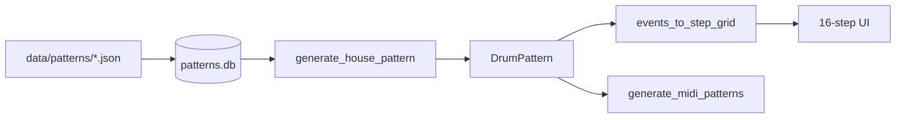

# Step Sequencer Visualizer — Design Plan (TR-8 workflow)

See also: **`PATTERN_MODEL_AND_STORAGE.md`** (slots, fills, JSON vs SQLite).

## Mental model (Roland TR-8S)

- **Pattern** = one groove preset (tempo, genre, kit).
- **Variations A–H** = eight **independent 1-bar** (16-step) grids.
- **Fill 1 / Fill 2** = two **1-bar** fills; triggered manually or auto every N bars.
- **Our ABAC chain** = pre-composed **4-bar loop** (A→B→A→C) for Ableton — not how TR-8 plays live, but export-friendly.

The UI shows **one slot at a time** (16 steps). The chain row shows how slots assemble for MIDI export.

---

## UI layout

```text
┌─ PATTERN house_1 ─ 120 BPM ────────────────────────────┐
│  [A][B][C][D][E][F][G][H]    [F1][F2]   ← active = green
├────────────────────────────────────────────────────────┤
│  KICK │■│□│□│□│■│□│□│□│■│□│■│□│■│□│□│□│  10px cells
│  SNR  │□│□│□│□│■│□│□│□│□│□│□│□│■│□│□│□│
│  CHH  │■│■│■│■│■│■│■│■│■│■│■│■│■│■│■│■│
├────────────────────────────────────────────────────────┤
│  CHAIN  [A]─[B]─[A]─[C]     Export: ●Chain ○Slots     │
│  AUTO FILL: every [4▼] bars → [FILL1▼]                  │
│  [Gen] [Mutate B] [Import seed] [Export MIDI]          │
└────────────────────────────────────────────────────────┘
```

- **Pad grid** = `events_to_step_grid(pattern.get_slot(active))` from `midi_beats/core/grid.py`
- **Slot buttons** = `DrumPattern.slots` keys
- **CHAIN** = `DrumPattern.chain` (editable preset)
- **Gen** = `generate_pattern_for_genre()` ; **Import** = `PatternStore.get_slot_events()`

---

## Implementation phases

| Phase | Deliverable |
|-------|-------------|
| **1** | ✅ `grid.py`, `pattern_model.py`, `DrumPattern` |
| **2** | Static HTML + `pattern.json` from `generate_pattern()` |
| **3** | `python -m midi_beats.visualizer` (future package) |
| **4** | Slot-level MIDI export + chain export toggle |
| **5** | Click-to-edit steps → `step_grid_to_events` → re-export |

---

## Data flow



---

## Visual spec

- Cells: 10–12px, gap 2px, `#0d0d0d` background
- Inactive `#1a1a1a`, active `#f5a623`, velocity → opacity
- Bar line every 16 steps; labels A|B|A|C when chain export shown

---

## Out of scope v1

- Audio preview, Scatter FX, step loop hold
