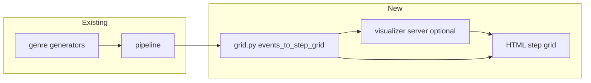

# Step Sequencer Visualizer — Design Plan

## Goal

A minimal, drum-machine-style UI (Elektron Beats / TR-909 inspired) that displays generated patterns on a **16-step grid** per channel, with small illuminated pads for active steps.

This is a **read-only preview** of `EventMap` data (and optional live regeneration), not a full DAW.

---

## Phase 1 — Data layer (backend, no UI)

### 1.1 Grid quantization module

Add `midi_beats/core/grid.py`:

```python
STEPS_PER_BAR = 16   # 16th-note steps
STEPS_PER_LOOP = 64  # 4 bars × 16 steps

def events_to_step_grid(
    events: EventMap,
    steps: int = STEPS_PER_LOOP,
    instruments: tuple[str, ...] | None = None,
) -> dict[str, list[StepCell]]:
```

- Map beat time `t` → step index `round(t * 4)` clamped to `[0, steps-1]`
- `StepCell`: `{ active: bool, velocity: int | None }` (velocity drives LED brightness later)
- Multiple hits on same step: keep **max velocity**

### 1.2 Manifest extension

Include grid snapshot in `manifest.json` (optional flag) for offline preview without re-parsing MIDI.

### 1.3 API endpoint shape (if web)

```json
{
  "genre": "house",
  "variation": 1,
  "steps": 64,
  "channels": [
    { "id": "kick", "label": "KICK", "steps": [{"on": true, "vel": 100}, ...] }
  ]
}
```

**Deliverable:** `events_to_step_grid()` + unit tests (known pattern → expected step indices).

---

## Phase 2 — Static web visualizer (recommended first UI)

### Stack

| Choice | Rationale |
|--------|-----------|
| **HTML + CSS + vanilla JS** or small **Vue/Svelte** | No heavy build for a grid |
| Served from `midi_beats/visualizer/static/` | Open `index.html` or `python -m midi_beats.visualizer` |
| Optional **FastAPI** wrapper | `GET /pattern?genre=house&seed=42&var=1` returns JSON grid |

### Layout (Elektron-inspired)

```
┌─────────────────────────────────────────────────────────┐
│  HOUSE · var 1 · 120 BPM · seed 1000                    │
├────┬────────────────────────────────────────────────────┤
│ KCK│ ■ □ □ □ ■ □ □ □ ■ □ ■ □ ■ □ □ □  │ bar markers
│ SNR│ □ □ □ □ ■ □ □ □ □ □ □ □ ■ □ □ □  │
│ CLP│ ...                                                │
│ HAT│ ■ ■ ■ ■ ■ ■ ■ ■ ■ ■ ■ ■ ■ ■ ■ ■  │
│ OHH│ ...                                                │
└────┴────────────────────────────────────────────────────┘
     │←── bar 1 ──→│←── bar 2 ──→│ ...
```

### Visual spec

- **Cell size:** 10–12px square, 2px gap (dense like hardware)
- **Inactive:** `#1a1a1a` border `#333`
- **Active:** amber/orange `#f5a623` (house), genre accent optional
- **Velocity:** opacity or inner glow `opacity = 0.4 + (vel/127)*0.6`
- **Bar divisions:** vertical line every 16 steps; ABAC labels A|B|A|C above bar 1–4
- **Font:** monospace labels, 10px, left column ~36px wide
- **No skeuomorphism** — flat, high contrast, dark background `#0d0d0d`

### Interactions (Phase 2)

- Dropdown: genre, variation, seed
- Button: **Regenerate** (calls Python via API or pre-baked JSON files)
- Read-only grid (no editing in v1)

**Deliverable:** `visualizer/` folder + `python -m midi_beats.visualizer --genre house --seed 42`.

---

## Phase 3 — Desktop-embedded (optional)

- **Tkinter / PyQt** mini window using same `events_to_step_grid()` — single process, no server
- Useful for notebook `%run` workflow beside Jupyter

---

## Phase 4 — Editing & export round-trip (future)

- Click toggles step → update `EventMap` → re-export MIDI
- Requires deduping quantization error and snap tolerance config

---

## Architecture diagram



---

## File plan

```
midi_beats/
  core/
    grid.py              # Phase 1
  visualizer/
    __init__.py
    __main__.py          # CLI to open browser
    server.py            # Optional FastAPI
    static/
      index.html
      style.css
      app.js
tests/
  test_grid.py
```

---

## Implementation order

1. **grid.py + tests** (1–2 hours agent time)
2. **Static HTML/CSS grid** with embedded sample JSON
3. **CLI** `python -m midi_beats.visualizer house --seed 42` writes `pattern.json` and opens UI
4. **FastAPI** only if browser needs live regeneration
5. Notebook cell: display grid via `IPython.display.HTML`

---

## Success criteria

- User sees 4-bar ABAC pattern at a glance without opening a DAW
- Kick on 1 and snare on 5/13 (steps 0, 4, 12 in 0-indexed 16ths) readable for house
- Matches `generate_events()` output for same seed (golden test)
- UI fits in ~400×200px per genre view

---

## Out of scope (v1)

- Audio preview
- Swing visualization (Phase 5: offset steps 2.25 visually)
- Multi-variation timeline scroll
- Mobile layout
